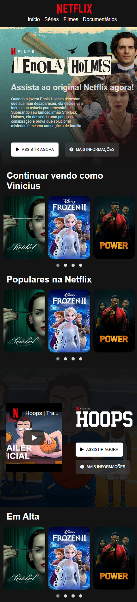

# netflix-clone
Aplicação da aula instruída pelo Felipe Aguiar no bootcamp da Digitan Innovation One. O objetivo foi replicar a tela inicial do Netflix, utilizando praticas de flex-box, wrappers, e bibliotecas de carousel

## Telas 

### Tela Desktop 

### Tela Mobile

